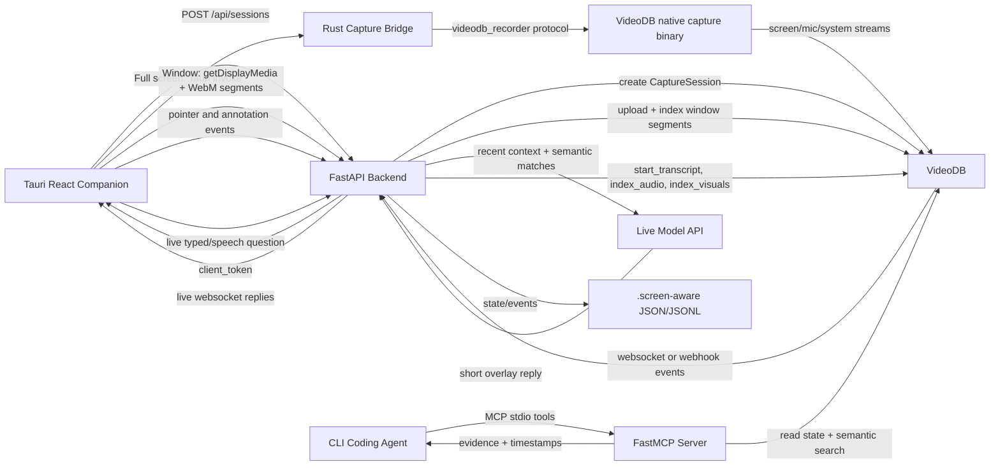

# Architecture

Screen-Aware is a local-first capture and MCP bridge. The desktop companion handles the native capture UX. The backend owns VideoDB sessions, indexing, and persisted state. The MCP server reads the same state and performs VideoDB semantic search for coding agents.

## System Flow

## Components

### Companion UI

- `companion/src/App.tsx` renders the minimalist capture controller.
- `companion/src/capture.ts` wraps Tauri commands and recorder events.
- `companion/src/styles.css` implements the monochrome neo-brutalist visual system: sharp borders, stark paper background, no gradients, no shadows.
- During active capture, the companion can expand into a transparent full-screen annotation overlay for pointer, pen, and highlighter tools.
- During active capture, the floating overlay has a live message box. Typed messages and supported speech-recognition transcripts are sent to the backend and live replies are shown immediately in the overlay.

### Rust/Tauri Capture Bridge

- `companion/src-tauri/src/lib.rs` spawns the VideoDB native capture binary from `companion/node_modules/videodb/bin/capture.exe` or `VIDEODB_CAPTURE_BINARY`.
- It sends recorder commands over stdin using the `videodb_recorder|{json}` line protocol.
- It exposes Tauri commands for permission requests, channel listing, start, pause, resume, stop, and shutdown.
- It also resizes the transparent Tauri window between normal setup, compact recorder, and full-screen annotation modes.

### Backend API

- `src/screen_aware/api.py` runs FastAPI on `127.0.0.1:8787` by default.
- `POST /api/sessions` creates a real VideoDB CaptureSession and returns a client token to the companion.
- `POST /api/window-capture/segments` accepts native-window WebM segments from the companion and queues VideoDB upload/indexing.
- `POST /api/live/messages` records the user's live message, gathers recent event/search context, calls the configured live model, broadcasts the answer through `/api/live`, and stores the exchange for MCP tools.
- `POST /webhooks/videodb` and the backend websocket listener normalize VideoDB events into local state.
- `GET /api/status`, `GET /api/events`, and `POST /api/query` provide local control-plane inspection.
- Pointer, pen, highlighter, and clear actions are stored as client events with normalized screen coordinates.

### VideoDB Service

- `src/screen_aware/videodb_service.py` calls `videodb.connect`, creates CaptureSessions, generates client tokens, opens VideoDB websocket listeners, uploads selected-window segments, starts transcripts, starts audio indexing, starts visual indexing, and searches RTStreams plus uploaded window media.
- SDK compatibility wrappers are intentionally thin; they call the real VideoDB SDK and only adapt minor signature differences.

### Local State

- `.screen-aware/state.json` stores backend status, current session, RTStreams, and indexing metadata.
- `.screen-aware/events.jsonl` stores recent lifecycle, transcript, visual, audio, and client events.
- Live overlay user messages and assistant replies are stored as `user.live_message` and `assistant.live_reply` events.
- This folder is ignored by git because it contains local runtime state and potentially sensitive workflow context.

### MCP Server

- `src/screen_aware/mcp_server.py` exposes a stdio FastMCP server.
- Tool names use the `screen_aware_` prefix so agents can discover the right tools quickly.
- All MCP tools are read-only from the coding agent's perspective.

## Session Lifecycle

1. Backend starts and opens a VideoDB websocket listener.
2. Companion requests a new session from `POST /api/sessions`.
3. Backend creates a VideoDB CaptureSession and client token.
4. In Full screen mode, companion initializes the Rust capture bridge with the client token.
5. Rust bridge asks for screen and microphone permissions, lists channel IDs, and starts recording with selected channels.
6. In Window mode, companion opens the native window picker, records WebM segments, and posts them to the backend.
7. If the user points or draws, the companion posts annotation events to the backend.
8. If the user types or speaks into the overlay, the backend calls the live model and pushes a concise response back into the floating overlay.
9. VideoDB emits `capture_session.active` for RTStreams, and the backend records window segment lifecycle events.
10. Backend starts transcript, audio indexing, and visual indexing for active RTStreams and uploaded window segments.
11. MCP tools search the indexed RTStreams/window segments plus live messages and recent annotation events, then return evidence to the CLI agent.

## Security Boundaries

- The VideoDB API key belongs in `.env` or the user environment, never in committed client config.
- MCP clients should pass `SCREEN_AWARE_ENV_FILE` and `SCREEN_AWARE_DATA_DIR`, not the key itself.
- `.screen-aware/`, `.env`, Tauri targets, and dependency folders are ignored.
- The MCP tools are read-only and do not execute code or mutate the developer project.
- Live model keys belong only in `.env` or user environment variables. They are never sent to the companion UI. The default provider is OpenRouter with Gemini 3 Flash as primary and Gemini Flash Lite models as fallbacks.
